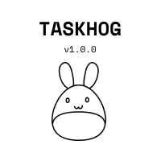
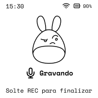
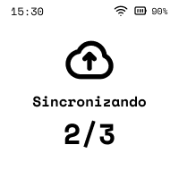

# Taskhog

> Capture de voz, offline-first → tarefas no Todoist.

Taskhog é um dispositivo físico **ESP32-S3 com display e-Paper** que grava notas de voz com um toque (push-to-talk), **nunca perde uma captura** (offline-first) e sincroniza com um **Hub self-hosted** (FastAPI + Whisper + LLM) que transcreve, estrutura e cria as tarefas no **Todoist**.

<p align="center">
  
  
  
  
</p>

## Como funciona

```text
┌─────────────────────────┐         Wi-Fi / Cloudflare         ┌──────────────────────────┐
│  Device (ESP32-S3)      │  ───  upload WAV + metadata  ───►  │  Hub (self-hosted)        │
│  • push-to-talk (REC)   │                                    │  • FastAPI                │
│  • grava WAV no microSD │                                    │  • faster-whisper (pt)    │
│  • fila offline (.job)  │  ◄───  status / contadores  ────   │  • LLM (estrutura+rota)   │
│  • UI e-Paper 200×200   │                                    │  • Todoist REST           │
└─────────────────────────┘                                    └──────────────────────────┘
```

**Regras de ouro:** captura nunca se perde · firmware "burro", Hub inteligente · idempotência fim-a-fim · contratos imutáveis durante a implementação (mudança → Spec 03 primeiro).

## Hardware

- Placa **Waveshare ESP32-S3 1.54" e-Paper V2** (sem touch), módulo `ESP32-S3-PICO-1-N8R8` (8 MB flash / 8 MB PSRAM).
- Display e-Paper **200×200 1bpp** (SSD1681), microSD, codec de áudio **ES8311** + mic, RTC PCF85063, bateria Li-Po 1S.
- Detalhes e pinos reais em [`docs/hardware/HARDWARE_NOTES.md`](docs/hardware/HARDWARE_NOTES.md).

## Estrutura do repositório

```text
taskhog-fw/    Firmware ESP-IDF (≥5.2, target esp32s3)
taskhog-hub/   Hub FastAPI (Python 3.11+, Whisper, LLM, Todoist)
ui/            Mockups das telas, fontes (SpaceMono) e assets (SVG)
tools/         gen_assets.py — gera fontes/imagens bitmap do firmware
docs/          PRD, specs (01–03), design e-Paper, hardware, decisões (ADRs)
```

## Status (roadmap)

| Milestone | Estado |
|---|---|
| M0 — Bring-up & gate de áudio | ✅ |
| M0.5 — Contratos + scaffold + infra Hub | ✅ |
| **M1 — Captura local offline (firmware)** | 🚧 em progresso (T1–T5 ✅, UI core ✅, fila `.job` pendente) |
| M2 — Hub MVP (Whisper→Todoist cru) | ⏳ |
| M3 — Integração online E2E | ⏳ |
| M4 — Inteligência (LLM + roteamento) | ⏳ |
| M5–M8 — Robustez · Energia · Provisionamento · Produção | ⏳ |

Board completo em [`docs/roadmap.md`](docs/roadmap.md).

## Firmware — build & flash

Requer ESP-IDF ≥ 5.2.

```bash
. ~/esp/esp-idf/export.sh        # carrega o ambiente ESP-IDF
cd taskhog-fw
idf.py build
idf.py -p /dev/cu.usbmodem* flash monitor
```

### Regenerar assets da UI (fontes + ícones)

As fontes SpaceMono e os ícones/mascote são gerados dos arquivos em `ui/` para arrays C (`taskhog-fw/components/ui/assets_*.c`). Os gerados são versionados; só regenere ao mudar assets:

```bash
python3 -m venv tools/.venv
tools/.venv/bin/pip install Pillow cairosvg
tools/.venv/bin/python tools/gen_assets.py
```

> A orientação do e-Paper é controlada num único lugar: `taskhog-fw/components/ui/epaper_cfg.h`. Ver [ADR 004](docs/decisions/004-epaper-ui-rebuild.md).

## Hub — desenvolvimento

```bash
cd taskhog-hub
cp .env.example .env        # preencher TODOIST_TOKEN, LLM_API_KEY, TASKHOG01_TOKEN
docker compose up --build   # expõe /v1/health em :8088
```

Segredos vivem só em `.env` (nunca commitado). `hub.yaml` usa placeholders de ambiente.

## Documentação

| Documento | Para quê |
|---|---|
| [`docs/prd/PRD_v1.0.md`](docs/prd/PRD_v1.0.md) | Visão de produto e requisitos |
| [`docs/specs/01-device-firmware.md`](docs/specs/01-device-firmware.md) | Firmware (áudio, fila, UI, energia) |
| [`docs/specs/02-hub-backend.md`](docs/specs/02-hub-backend.md) | Hub (API, pipeline, Whisper, Todoist) |
| [`docs/specs/03-data-contracts.md`](docs/specs/03-data-contracts.md) | **Fonte de verdade** dos contratos JSON |
| [`docs/design/epaper-ui-spec.md`](docs/design/epaper-ui-spec.md) | UI e-Paper (telas, layout, assets) |
| [`docs/decisions/`](docs/decisions/) | Decisões arquiteturais (ADRs) |

---

Projeto pessoal · hardware + firmware + backend. Português (BR) é o idioma da UI e dos docs.
